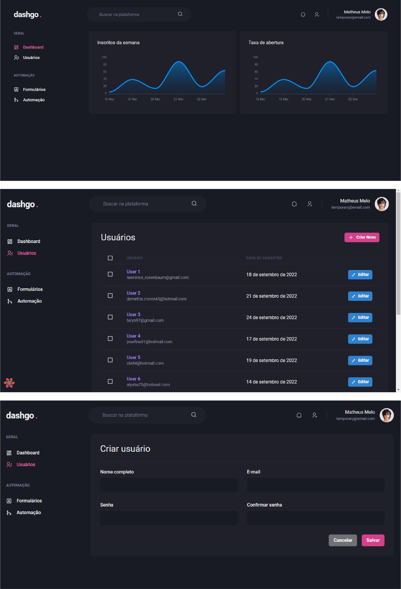

<div align="center">
    
</div>
<p align="center">🚀 Dashboard</p>

<div align="center">
 <a href="#-objective">objective</a> •
 <a href="#-roadmap">roadmap</a> •
 <a href="#-technologies">technologies</a> •
 <a href="#-author">author</a>
</div>

---
</br>

>  ### Screens

</br>

<p align="center">
  
</p>

<div align="left">
    
</div>

<br />

## 💡 Objective
<p>A site that shows a users dashboard.
The purpose of this project is only for studies on Chakra UI (declarative interface), responsive design, pagination, data fetching and local cache with React query.</p>

* **Important**: This project was built without a backend, so it's not production-ready.

## 🎌 Roadmap

### Prerequisites
Before starting, you will need to have the following tools installed on your machine:
<ul>
  <li><a href="https://nodejs.org/en/">Node</a></li>
</ul>

You can also use npm, but we seriously recommend yarn.

Also it's nice to have an editor to work with the code like [VSCode](https://code.visualstudio.com/).

### Running the server


**Execute the commands**

```bash
# Clone this repository
$ git clone https://github.com/mathmelo/dashgo

# Access the project folder in the terminal/cmd
$cd dashgo

# Install dependencies
$ yarn

# Run server
$ yarn dev

# The server will start on port:3000 - go to <http://localhost:3000>
```

## 💜 Technologies
- Typescript
- NextJs
- Chakra UI
- React Query
- MirageJS
- React Hook Form
- Apexcharts

<br>

---

## 🤓 Author

Informations about [me](https://github.com/mathmelo).
Send me a message! ;)
